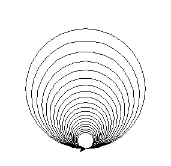
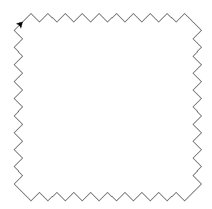
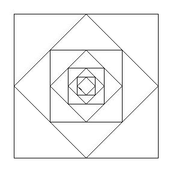

Exercices
=========

Exercice 1
----------

1. Donner dans chaque cas les valeurs affichées par la boucle ``for``.

   a. 
      .. code:: python
      
         for m in range(5):
             print(m)
             
   b. 
      .. code:: python
      
         for k in range(4,8):
             print(k)
             
   c.
      .. code:: python
      
         for nombre in range(1,19,3):
             print(nombre)
             
   d.
      .. code:: python
      
         for i in range(5):
             print(i*10-1)

2. Écrire une boucle ``for`` pour afficher la suite de nombres dans chaque cas:

   a. ``5, 6, 7, 8, 9``
   b. ``0, 2, 4, 6, 8, 10, 12, 14, 16, 18``
   c. ``-1, -2, -3, -4, -5``
   d. ``4, 9, 16, 25, 36``

Exercice 2
----------

Soit ``t`` une variable de type tableau telle que ``t=[5,7,4,9,6,3,0,1,6]``.

#. Dans un éditeur Python, créer la variable ``t``.
#. Écrire un code qui modifient les valeurs du tableau ``t`` en multipliant chaque valeur par 3.
#. Écrire un code qui modifient les valeurs du tableau ``t`` en soustrayant 10 à chaque valeur.
#. Écrire un code qui modifient les valeurs du tableau ``t`` en élevant au carré chaque valeur.
#. Écrire un code qui remet à 0 chaque valeur de ``t``.

Exercice 3
----------

Soit ``t`` une variable de type tableau telle que ``t=[5,7,4,9,6,3,0,1,6]``.

#. Dans un éditeur Python, créer la variable ``t``.
#. Écrire un code qui calcule la somme des valeurs du tableau ``t``.
#. Écrire un code qui calcule la valeur moyenne du tableau.

Exercice 4
-----------

Écrire un code Python pour réaliser la figure suivante:

   
Quelques conseils:

- importer le module turtle : ``from turtle import *``
- définir une variable ``r`` pour le rayon du cercle
- le rayon de chaque cercle diminue de 10%

Exercice 5
----------

Écrire un code Python pour réaliser la figure suivante:

   
Quelques recommandations:

- importer le module turtle : ``from turtle import *``
- définir la variable ``l`` pour la dimension des dents
- définir la variable ``n`` pour le nombre de dents sur une ligne
- commencer par construire la ligne horizontale supérieure
- poursuivre avec les 3 autres côtés

Exercice 6
----------

Écrire un code Python pour réaliser la figure suivante:

   
Quelques recommandations:

- importer le module turtle : ``from turtle import *``
- importer la fonction ``sqrt`` du module math : ``from math import sqrt``
- définir la variable ``c`` pour la longueur du côté du carré
- commencer par construire le grand carré
- déplacer la tortue jusqu'au milieu d'un côté
- calculer la nouvelle dimension du prochain carré
- recommencer jusqu'à avoir 8 carrés imbriqués
